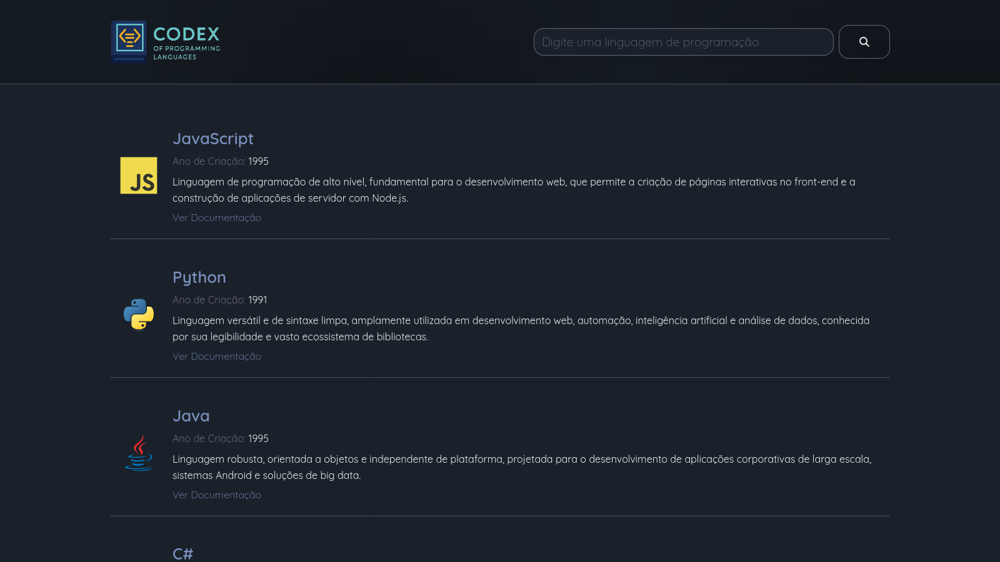

<div align="center">

<a href="https://github.com/0nF1REy/codex-programming-languages" target="_blank">
    
</a>

</br>


</div>

## 🧭 Guia de Navegação (Índice)

- **[📖 Visão Geral](#descricao)**
- **[📁 Estrutura Principal](#estrutura-principal)**
- **[✨ Principais Funcionalidades](#principais-funcionalidades)**
- **[🚀 Tecnologias Utilizadas](#tecnologias-utilizadas)**
- **[🚀 Começando](#comecando)**
- **[🛠️ Como Usar](#como-usar)**
- **[👤 Sobre o Desenvolvedor](#-sobre-o-desenvolvedor)**
- **[📜 Licença](#licenca)**

<h2 align="center">
  Codex Programming Languages
</h2>

<p align="center">
Um catálogo web interativo de linguagens de programação com uma base de conhecimento que se expande automaticamente usando a API do Gemini.
</p>
<div align="center">

</div>
<p align="center"><sub>Página Inicial</sub></p>

## 📖 Visão Geral <a name="descricao"></a>

Este repositório reúne dois trabalhos complementares relacionados ao tema "linguagens e ferramentas de programação":

- Um site estático (em `src`) que apresenta um catálogo de linguagens/tecnologias e ativos (imagens, dados e estilos). Chamamos essa parte de **Codex**.
- Uma ferramenta Node.js (`knowledge-generator`) para expandir automaticamente uma base de conhecimento em JSON usando a API Gemini, que gera entradas estruturadas sobre tecnologias.

O objetivo conjunto é fornecer uma vitrine (site) alimentada por uma base de dados que pode ser aumentada automaticamente pelo gerador.

## 📁 Estrutura Principal <a name="estrutura-principal"></a>

- `knowledge-generator/` — Script Node.js com a lógica do Gemini.
- `resources/` — Imagens e assets para a documentação.
- `src/` — Código-fonte do catálogo (HTML, CSS, JS).
- `.env.example` — Exemplo de arquivo de ambiente.
- `package.json` — Dependências e scripts do projeto.
- `README.md` — Esta documentação.

## ✨ Principais Funcionalidades <a name="principais-funcionalidades"></a>

O projeto é dividido em duas partes principais: uma interface de usuário rica e um gerador de conteúdo inteligente.

### 🖥️ Frontend (Codex)

- Interface Interativa e Responsiva: Desenvolvida com HTML5, CSS3 e JavaScript puro, a interface é totalmente responsiva e se adapta a desktops, tablets e dispositivos móveis.

- Busca Dinâmica: Filtre linguagens em tempo real com um campo de busca inteligente que atualiza a interface de forma fluida.

- Animações com GSAP: A experiência do usuário é aprimorada com animações de alta performance, incluindo um preloader, transições suaves de entrada para os cards e um header que reage ao scroll.

- Fallback de Imagens: Garante que a interface não quebre caso uma imagem de logo não seja encontrada, substituindo-a por um placeholder.

- Foco em Acessibilidade (A11y): Uso de atributos ARIA para melhorar a experiência de usuários que utilizam leitores de tela.

### 🤖 Backend (Knowledge Generator)

- Geração de Conteúdo com IA: Um script em Node.js utiliza a API do Gemini para gerar novas entradas sobre linguagens de programação, seguindo um schema JSON pré-definido.

- Expansão Automatizada: O script verifica as linguagens já existentes no arquivo data.json para evitar duplicatas, garantindo que o catálogo cresça de forma consistente.

- Robusto e Resiliente: Implementa um sistema de tentativas com backoff exponencial para lidar com falhas de rede ou instabilidades da API.

## 🚀 Tecnologias Utilizadas <a name="tecnologias-utilizadas"></a>


## 🚀 Começando <a name="comecando"></a>

Para executar este projeto localmente, siga os passos abaixo.

**Pré-requisitos**

- **Node.js** (versão 18 ou superior)
- **Chave da API do Google Gemini**

**1.** Clone o repositório:

```bash
git clone https://github.com/0nF1REy/codex-programming-languages.git
cd codex-programming-languages
```

**2.** Crie um arquivo **.env** na raiz do projeto e adicione sua chave da API:

```bash
GEMINI_API_KEY="SUA_CHAVE_AQUI"
```

**3.** Instale as dependências do gerador:

```bash
npm install
```

## 🛠️ Como Usar <a name="como-usar"></a>

**1. Gerador de Conhecimento (Backend)**

Para gerar novas entradas e adicioná-las ao **src/data/data.json**, execute o seguinte comando:

```bash
npm start
```

- **Observação:** Para alterar a quantidade de itens gerados por execução, edite a constante _TOTAL_ITEMS_ no arquivo _knowledge-generator/generator.js_.

**2. Visualizando o Catálogo (Frontend)**

Para visualizar a interface web, você pode usar um servidor local. A forma mais simples é com o **serve**:

```bash
npx serve src
```

Acesse **http://localhost:3000** (ou a porta indicada no seu terminal) no seu navegador.

---

## 👤 Sobre o Desenvolvedor <a name="sobre-o-desenvolvedor"></a>

<div align="center">

<table>
  <tr>
    <td align="center">
        <br>
        <a href="https://github.com/0nF1REy" target="_blank">
          
        </a>
        </p>
        <a href="https://github.com/0nF1REy" target="_blank">
          <strong>Alan Ryan</strong>
        </a>
        </p>
        ☕ Peopleware | Tech Enthusiast | Code Slinger ☕
        <br>
        Apaixonado por código limpo, arquitetura escalável e experiências digitais envolventes
        </p>
          Conecte-se comigo:
        </p>
        <a href="https://www.linkedin.com/in/alan-ryan-b115ba228" target="_blank">
          
        </a>
        <a href="https://gitlab.com/alanryan619" target="_blank">
          
        </a>
        <a href="mailto:alanryan619@gmail.com" target="_blank">
          
        </a>
        </p>
    </td>
  </tr>
</table>

</div>

---

## 📜 Licença <a name="licenca"></a>

Este projeto está sob a **licença MIT**. Consulte o arquivo **[LICENSE](LICENSE)** para obter mais detalhes.

> ℹ️ **Aviso de Licença:** © 2025 Alan Ryan da Silva Domingues. Este projeto está licenciado sob os termos da licença MIT. Isso significa que você pode usá-lo, copiá-lo, modificá-lo e distribuí-lo com liberdade, desde que mantenha os avisos de copyright.

⭐ Se este repositório foi útil para você, considere dar uma estrela!
